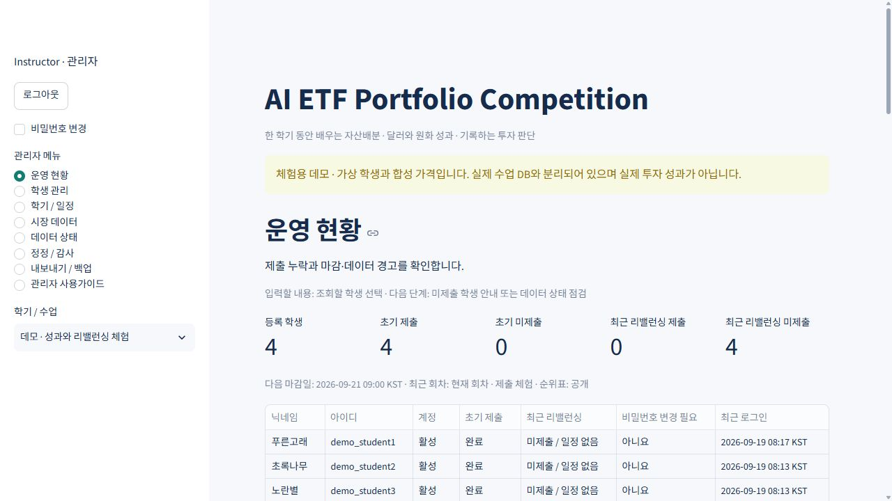
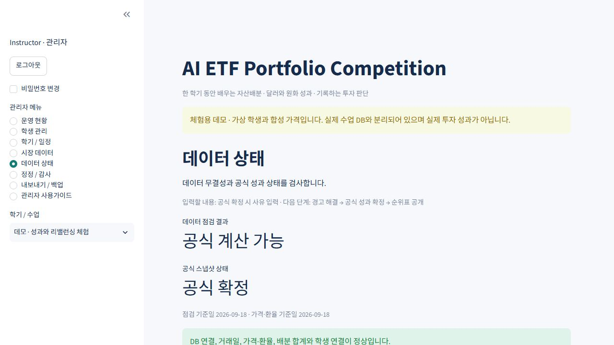

# 관리자 사용설명서

AI ETF Portfolio Competition · 2026-09-19 · 로컬 운영 및 웹 배포 준비판

이 설명서는 교수자가 수업을 만들고 학생 제출을 관리하며 공식 성과를 확정하는 순서로 구성했습니다. 프로그램 코드를 수정하지 않고 화면에서 운영할 수 있습니다. 최초 서버 설치와 외부 공개는 별도 「설치·배포·복구 안내」를 참고하세요.

## 1. 처음 시작하기

운영 순서는 **로그인 → 학기 설정 → 학생 등록 → 제출 확인 → 리밸런싱 설정 → 성과·순위 확인 → 백업·내보내기**입니다. 먼저 별도 데모에서 메뉴를 연습하고 실제 수업을 만드세요. 데모의 학생과 가격은 가상 자료입니다.

앱 주소를 열고 발급받은 관리자 아이디와 비밀번호를 입력한 뒤 **로그인**을 누릅니다. 임시 비밀번호 계정은 **처음 로그인 · 비밀번호 변경** 화면에서 현재 비밀번호, 8자 이상 새 비밀번호, 새 비밀번호 확인을 입력하고 **비밀번호 변경**을 누릅니다. 기본 공용 비밀번호는 없습니다.

로그인 실패 시 아이디와 비밀번호를 확인하세요. 5회 실패하면 15분간 잠깁니다. 비활성 계정은 접속할 수 없습니다. 로그인 세션은 8시간 후 만료됩니다. 왼쪽 **로그아웃**으로 종료하세요. 작은 화면에서는 왼쪽 위의 사이드바 펼침 버튼으로 메뉴를 엽니다.

### 화면 안내

| 메뉴 | 하는 일 | 다음 단계 |
| --- | --- | --- |
| 운영 현황 | 제출 수, 누락, 마감, 학생 성과 조회 | 학생 관리 또는 데이터 상태 |
| 학생 관리 | 계정 생성, 수강 등록, 비밀번호 재설정 | 학생에게 계정 개별 전달 |
| 학기 / 일정 | 학기 생성, 기본 학기, 공개, 보관, 일정 | 학생 등록 및 제출 확인 |
| 시장 데이터 | 가격·환율 저장, CSV 정정 | 데이터 상태 |
| 데이터 상태 | 누락·오류 검사, 공식 성과 확정 | 운영 현황 및 순위 공개 |
| 정정 / 감사 | 배분 정정과 변경 이력 확인 | 공식 성과 재확정 |
| 내보내기 / 백업 | 분석 자료와 복구용 DB 다운로드 | 안전한 위치에 보관 |
| 관리자 사용가이드 | 이 설명서 열람 | 필요한 메뉴로 이동 |

왼쪽 **학기 / 수업**에서 현재 조회 대상을 확인하세요. 선택만 바꾸면 조회 대상이 바뀝니다. **운영 학기로 설정**은 다른 사용자에게도 로그인 후 기본 표시할 학기를 바꿉니다. 이전 기록을 삭제하지 않습니다. 한 설치의 관리자는 모든 수업을 관리합니다. 교수자별로 서로의 수업을 숨기는 기관 간 분리는 제공하지 않습니다.

## 2. 새 학기 만들기

**학기 / 일정**에서 아래 항목을 입력합니다.

| 입력 항목 | 의미와 예 |
| --- | --- |
| 학기 / 수업 이름 (필수) | 예: 2026 가을 · 투자론 A반 |
| 포트폴리오 시작일 | 성과 측정의 시작 날짜 |
| 학기 종료일 | 이 날짜 이후 성과는 포함하지 않음 |
| 초기 자산배분 마감일 (한국 시간) | 반드시 시작일 이전으로 지정 |
| 초기 자산배분 마감 시각 | 예: 18:00, 한국 표준시 |

날짜 확인 체크박스를 선택하고 **새 학기 생성**을 누르세요. 생성 성공 메시지 후 사이드바에서 새 학기를 선택합니다. 기본 표시 학기 변경 확인란을 체크한 뒤 **운영 학기로 설정**을 누릅니다. 이어서 학생에게 앱 URL과 학기 이름을 전달하면 학생이 로그인 화면에서 직접 회원가입하고 수업을 선택할 수 있습니다. 직접 가입한 학생은 비밀번호를 재변경하지 않습니다. 교수자가 계정을 대신 만드는 경우에는 **학생 관리**에서 수강 등록하세요.

생성한 학기 날짜는 화면에서 수정할 수 없습니다. 잘못 만든 빈 학기는 보관하고 새 학기를 만드세요. 이미 제출이 있는 학기는 먼저 백업하고 운영 담당자와 처리 방법을 정하세요. DB 파일을 직접 고치면 공식 성과와 감사 기록의 의미가 훼손될 수 있습니다.

## 3. 학생 등록과 계정 관리

**학생 관리**에서 **학생 아이디 (필수)**, **공개 닉네임 (필수)**, **임시 비밀번호 (8자 이상)**를 입력하고 **학생 등록**을 누릅니다. 예를 들어 아이디는 student01, 닉네임은 푸른고래처럼 설정할 수 있습니다. 실제 비밀번호는 학생별로 다르게 생성하여 개별 전달하세요.

성공 메시지와 아래 학생 목록을 확인합니다. 학생에게 앱 URL, 아이디, 임시 비밀번호, 학기 이름, 초기 제출 마감 시각을 전달하세요. 학생은 첫 로그인에서 비밀번호를 바꿉니다. 공개 순위표에는 닉네임이 표시되므로 실명이나 이메일 대신 수업용 별칭을 권장합니다.

기존 계정을 다음 학기에 재사용하려면 먼저 왼쪽 학기를 바꾸고 **기존 학생**을 선택한 뒤 **선택 학기에 수강 등록**을 누릅니다. 계정을 새로 만들 필요가 없습니다. 수강 등록은 학기별로 분리됩니다.

닉네임 변경은 **닉네임 수정**에 입력합니다. 접속을 중지하려면 **계정 활성화**를 해제합니다. 비밀번호를 잊은 학생에게는 **비밀번호 재설정 (필요할 때만)**에 새 임시 비밀번호를 넣습니다. 빈칸이면 기존 비밀번호가 유지됩니다. 영향 확인란을 체크하고 **학생 정보 저장**을 누르세요. 비활성화는 모든 학기 접근을 막지만 기록은 보존합니다. 다시 활성화하면 접근을 복구할 수 있습니다.

## 4. 제출 현황과 학생 성과 확인

**운영 현황**의 등록 학생, 초기 제출, 초기 미제출, 최근 리밸런싱 제출, 최근 리밸런싱 미제출 숫자를 확인하세요. 최근 회차와 다음 마감일도 표시됩니다. 아직 회차가 없으면 최근 리밸런싱 미제출은 0으로 표시됩니다. 표에서 학생별 계정 상태, 초기 제출, 최근 회차 제출, 비밀번호 변경 필요 여부, 최근 로그인 시각을 볼 수 있습니다.

**학생 포트폴리오 조회**에서 학생을 선택하면 개인 성과와 제출 이력을 확인할 수 있습니다. 공식 순위가 확정되어 있으면 클래스 평균 달러 수익률과 순위표도 나타납니다. 초기 미제출 학생은 투자 비중이 없으므로 성과·순위 대상에 포함하지 않습니다. 관리자 정정은 기존 제출에만 가능하며 미제출 학생의 제출을 대신 생성하는 기능은 없습니다.

미제출 학생에게 마감 전에 안내하세요. 마감 이후 학생의 직접 제출은 거절됩니다. 리밸런싱을 제출하지 않으면 기존 보유 자산을 유지합니다. 이는 매일 처음 비중으로 되돌린다는 뜻이 아닙니다.

## 5. 리밸런싱 일정 등록

**학기 / 일정**의 **리밸런싱 일정 추가**에서 회차 이름, 시작일·시각, 마감일·시각, 적용일을 설정하고 **일정 추가**를 누릅니다. 기본 다음 적용일은 이전 적용일 또는 시작일에서 14일 뒤입니다. 자동 반복 예약이 아니라 회차별로 등록하는 방식입니다.

시작과 마감은 한국 시간입니다. 적용일은 미국 시장의 날짜입니다. 시작 < 마감 < 적용일 순서를 지켜야 하며, 마감 시각을 UTC로 바꾼 날짜도 적용일보다 앞서야 합니다. 적용일 전날 한국 시각 18:00 등 충분히 이른 마감을 권장합니다. 서로 겹치는 일정은 등록할 수 없습니다. 등록한 일정은 고정되므로 버튼을 누르기 전에 다시 확인하세요.

예: 미국 거래일 2026-10-05 적용을 원한다면, 2026-10-02 09:00부터 2026-10-04 18:00까지 제출받습니다. 적용일이 휴장일이면 그 이후 첫 미국 거래일 종가에서 적용됩니다. 학생은 기간 안에 한 번만 최종 제출할 수 있고 변경 사유를 20자 이상 입력해야 합니다.

적용 거래일의 수익은 기존 보유에 먼저 반영되고 그날 종가로 새 비중을 맞춥니다. 새 비중의 투자 성과는 그 다음 가격 변동부터 반영됩니다. 이전 기간의 성과를 새 비중으로 다시 계산하지 않습니다.

## 6. 무료 시장 자료 저장

**시장 데이터**에서 **가져오기 시작일**, **가져오기 종료일**을 지정하고 **무료 시장 데이터 가져오기**를 누릅니다. 최초에는 학기 시작일부터 어제까지, 이후에는 마지막 저장일부터 어제까지 가져오세요. 이전 학기의 자료가 필요하면 해당 시작일부터 기존 첫 저장일까지 연속된 기간을 포함하세요.

SPY, IEF, GLD, VNQ, SGOV의 수정종가와 KRW=X의 일별 종가를 무료 공급원에서 가져옵니다. 시스템은 거래일과 직전 거래일 연결, 모든 ETF 가격, 환율을 검사합니다. 오늘의 미완성 자료는 저장하지 않습니다. 기존 날짜는 자동으로 덮어쓰지 않으며 새로운 일별 자료만 추가합니다. 성공 메시지 후 아래 표의 날짜와 환율을 확인하세요.

인터넷 장애나 공급원 제한으로 실패하면 저장되지 않은 구간을 나중에 다시 가져오세요. 학생 제출 기록은 그대로 남습니다. 프로그램을 다시 시작해도 DB에 저장된 가격은 유지됩니다. 조회할 때마다 과거 가격을 다시 내려받지 않습니다. 시장 자료 수집은 관리자의 수동 실행이며 예약 자동 수집은 포함하지 않습니다.

### CSV 입력과 가격 정정

**검증된 CSV 가져오기 / 데이터 정정**을 펼치고 **시장 CSV 양식 다운로드**로 열 이름을 받습니다. CSV의 날짜는 YYYY-MM-DD, 숫자는 쉼표·통화 기호 없는 양수로 넣습니다. ETF 이름 열은 수정종가이고 `_factor` 열은 같은 수집본의 당일 수정종가 ÷ 직전 미국 거래일 수정종가입니다. 예를 들어 1.01은 +1%이며 0.01이 아닙니다. `fx`는 달러당 원화, `previous_day`는 직전 미국 거래일입니다.

**시장 데이터 CSV**에 파일을 올리고 **CSV 검증 및 저장**을 누릅니다. 기존 날짜를 정정하려면 **기존 날짜를 정정 버전으로 추가 (성과 재계산)**를 체크하고 **시장 데이터 정정 사유** 및 영향 확인란을 작성하세요. 정정은 새 버전으로 저장하며 이전 버전과 감사 기록을 남깁니다. 수정종가 개정 때문에 가격만 바꾸고 배율을 그대로 두지 마세요. 배율이 영향을 받는 인접 날짜도 같은 수집본으로 검증해야 합니다.

시장 자료는 한 설치의 여러 학기가 공유합니다. 공통 날짜를 정정하면 그 날짜를 포함한 다른 학기도 재확정이 필요할 수 있습니다.

## 7. 데이터 검사와 공식 성과 확정

**데이터 상태**에서 데이터 점검 결과, 공식 스냅샷 상태, 점검 기준일, 가격·환율 기준일을 확인합니다. 정상이라면 **공식 성과 확정 사유**를 입력하고 **공식 성과 확정**을 누르세요. 확정 번호와 확정 시각이 표시되면 저장된 것입니다.

확정본은 각 학생의 일별 USD NAV, KRW NAV, 수익률, ETF 기준선, 순위, 측정일과 사용한 자료 식별자를 영구 저장합니다. 이전 확정본은 삭제하거나 덮어쓰지 않습니다. 가격이나 배분 등 계산 입력이 바뀌면 **재확정 필요**로 바뀌고 순위표는 차단됩니다. 데이터를 다시 점검하고 재확정하세요.

| 상태 또는 경고 | 처리 방법 |
| --- | --- |
| 시장 자료 없음 / 거래일 누락 | 시장 데이터에서 시작일부터 누락 구간을 포함해 가져오기 |
| ETF 가격 또는 환율 오류 | 공급 자료 검증 후 CSV 정정, 다시 점검 |
| 비정상 배율 | 0.5 미만 또는 1.5 초과 일별 배율 확인; 검증 전 확정 불가 |
| 자료가 오래됨 | 최근 완료 거래일까지 갱신; 4일 초과 지연은 차단 |
| 배분 합계 오류 / 학생 연결 오류 | 정정·수강 등록 확인, 필요하면 복원 전 백업 |
| 미확정 / 재확정 필요 | 경고 해결 후 공식 성과 확정 |
| DB 연결 오류 | 배포 서버와 DB 연결 확인; 복구 안내 참고 |

학기 진행 중에는 어제까지의 미국 거래일을 기준으로 누락을 검사하고, 종료된 학기는 종료일까지 검사합니다. 휴장일은 누락으로 취급하지 않습니다. 미완성 자료로 임의 순위를 표시하지 않습니다.

## 8. 순위표 공개와 성과 읽기

**학기 / 일정**에서 **순위표 공개 (OPEN)**를 체크하고 영향 확인 후 **운영 설정 저장**을 누릅니다. 해제하면 학생의 순위표 메뉴가 사라지고 서버에서도 접근을 거절합니다. 공개 체크만으로는 충분하지 않으며 정상 자료와 유효한 공식 확정본이 있어야 순위가 표시됩니다.

순위는 USD 누적수익률을 소수점 6자리로 비교하고 동률은 1, 1, 3 방식입니다. 순위표에는 닉네임, 수익률, 순위, 측정 기준일과 상태만 공개합니다. 학생의 비중과 변경 사유, 로그인 정보는 다른 학생에게 공개하지 않습니다. 최근 2주는 측정일 14일 전 또는 그 이전 가장 가까운 관측일 대비 성과입니다.

NAV는 기준가입니다. USD NAV 100에서 105가 되면 달러 수익률은 5%입니다. 원화 NAV는 USD NAV에 시작일 대비 환율 변화를 곱합니다. 원/달러 환율이 오르면 원화 성과가 달러 성과보다 높아질 수 있습니다. 이는 수수료·세금·슬리피지를 반영하지 않는 교육용 모의 성과입니다. 수정종가에 반영된 배당·분할 효과 외에 배당 현금을 다시 더하지 않습니다.

## 9. 배분 정정과 감사 기록

**정정 / 감사**에서 **정정할 제출**을 선택합니다. 학생 번호, 적용일, 초기 배분인지 리밸런싱인지 확인하세요. 새 비중 합계를 정확히 100%로 맞추고 **배분 정정 사유 (필수)**에 요청자와 근거를 적습니다. 이전 비중과 새 비중의 검토표를 읽고 **정정 내용과 성과 재계산을 확인했습니다.**를 체크한 후 **정정 버전 저장**을 누릅니다.

학생의 원래 제출일·적용일은 유지되며 새 배분 버전만 추가됩니다. 아래 **감사 로그 · 이 설치의 전체 수업**에서 시각, 관리자 번호, 작업, 대상, 이전 값, 변경 값, 사유를 확인하세요. 잘못 정정했다면 이전 비중으로 다시 정정하여 복구 사유를 남기세요. 기존 버전을 삭제하지 않습니다. 마지막으로 **데이터 상태 → 공식 성과 확정**을 수행해야 순위가 다시 유효해집니다.

## 10. 내보내기와 백업

**내보내기 / 백업**에서 필요한 파일을 다운로드하고 실제 저장 위치와 파일 크기를 확인하세요.

| 버튼 | 내용과 용도 |
| --- | --- |
| 학기 CSV 묶음 다운로드 | ZIP: 영문 열 CSV, 학기 JSON, 공식 성과·순위·감사 기록, 한국어 데이터 사전 |
| 학기 데이터 다운로드 | 선택 학기의 분석용 JSON |
| 전체 논리 백업 다운로드 | 전체 학기 JSON; 비밀번호 제외, 완전 복구용 아님 |
| 완전 복구용 DB 백업 준비 | SQLite의 일관된 DB 사본 준비 |
| 완전 복구용 DB 다운로드 | 준비한 시점의 전체 DB 파일 저장 |

완전 복구용 DB에는 비밀번호 해시와 모든 학생 기록이 들어갑니다. 관리자만 접근하는 별도 저장 위치에 보관하세요. 내보낸 CSV는 분석용이며 다시 올려 전체 시스템을 복구하는 용도가 아닙니다. PostgreSQL에서는 DB 다운로드 버튼 대신 공급자의 백업 또는 pg_dump를 사용합니다.

수업 운영일마다, 가격·배분 정정 전, 학기 보관 전, 배포 업데이트 전에 백업하세요. 파일명에 날짜를 붙이고 최근 사본 여러 개를 유지합니다. 정기적으로 새 경로에 복원하여 로그인, 제출 이력, 성과가 읽히는지 확인해야 백업을 신뢰할 수 있습니다.

## 11. SQLite 장애 복구

실행 중인 앱 터미널에서 Ctrl+C로 중지합니다. 프로젝트 폴더에서 PowerShell을 열고 `.\recovery.ps1`을 실행합니다. 백업 .db 파일의 전체 경로와 새 복원 파일 경로(예: data/restored-20260919.db)를 입력합니다. 경로를 확인한 뒤 `복원`을 입력하면 무결성을 검사하고 새 파일로 복원하여 앱을 시작합니다. 기존 목적지 파일이 있으면 중단하며 덮어쓰지 않습니다.

복원 후 관리자와 학생 로그인이 되는지, 제출 수와 이력이 맞는지, 성과 기준일이 맞는지 확인합니다. 이후 실행은 `.\start_recovered.ps1`을 사용하세요. 이 명령은 저장한 복원 경로를 다시 사용합니다. 일반 start.ps1은 기존 운영 설정을 사용하므로 복원본 확인 전 혼용하지 마세요. 실패하면 기존 DB와 백업을 보존하고 담당자에게 오류 메시지와 발생 시각을 전달하세요. 비밀번호나 DB 접속 문자열은 함께 보내지 않습니다.

## 12. 학기 보관과 다음 학기 준비

종료일 자료까지 저장하고 공식 성과를 확정합니다. 학기 ZIP과 완전 DB 백업을 다운로드합니다. **학기 / 일정 → 학기 보관 · 학생 제출 중단**을 체크하고 영향 확인 후 **운영 설정 저장**을 누릅니다. 학생은 기존 이력을 열람할 수 있지만 새 제출은 할 수 없습니다. 순위 공개는 별도 설정입니다.

새 학기를 생성하고 사이드바에서 선택한 뒤 운영 학기로 설정합니다. 기존 학생을 새 학기에 수강 등록하고 날짜·회차를 검토하세요. 이전 학기는 남아 있으며 새 학기 비중과 제출은 독립적입니다. 보관을 잘못했다면 보관 체크를 해제하고 저장할 수 있지만, 이미 지난 마감 시각은 다시 열리지 않습니다.

## 13. 자주 묻는 문제

**제출 버튼이 비활성입니다.** 합계 100%, 필수 사유, 확인 체크박스, 제출 기간을 확인하세요. 학생의 최종 제출 후에는 직접 수정할 수 없습니다.

**학생이 학기를 못 봅니다.** 계정 활성화와 선택 학기 수강 등록을 확인한 후 다시 로그인하게 하세요.

**순위 공개인데 표가 없습니다.** 데이터 상태 경고와 공식 확정 여부를 확인하세요. 정정이나 새 자료 저장 후에는 재확정이 필요합니다.

**새 학기에 기존 자료가 보입니다.** 사이드바 학기를 확인하세요. 공통 시장 자료와 학생 계정은 공유하지만 배분·제출·공식 성과는 학기별입니다.

**페이지를 새로 고치면 로그인 화면으로 돌아갑니다.** 로그인 세션과 영구 데이터는 다릅니다. 다시 로그인하면 DB에 저장된 제출과 성과를 확인할 수 있습니다.

**무료 데이터가 자주 실패합니다.** 잠시 후 재시도하거나 검증된 CSV를 사용하세요. 자료가 불완전할 때 공식 성과를 강제로 공개하는 기능은 없습니다.

**웹에 공개하고 싶습니다.** 외부 호스팅과 영구 PostgreSQL 계정이 필요합니다. 「설치·배포·복구 안내」의 절차에 따라 HTTPS URL을 만든 후 학생에게 배포하세요. 현재 localhost 주소는 같은 컴퓨터에서만 열립니다.
