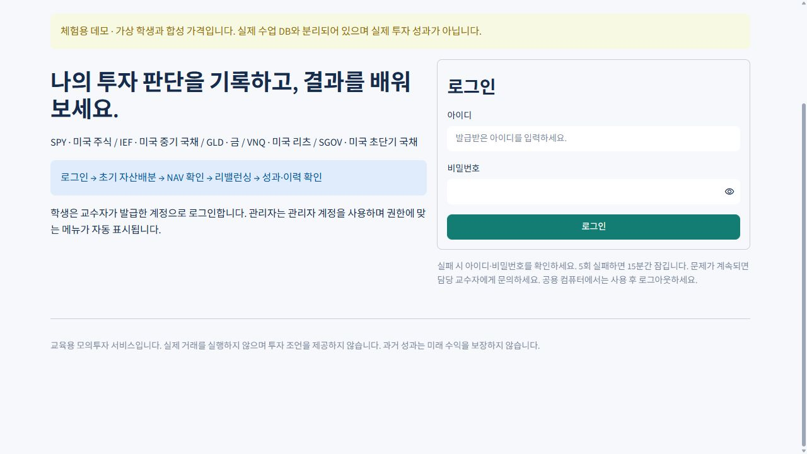
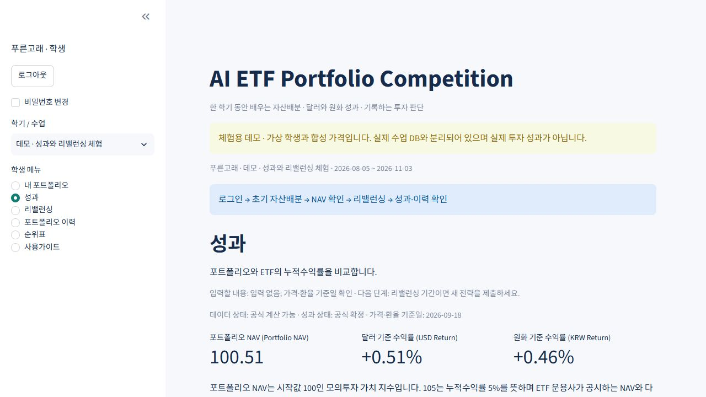
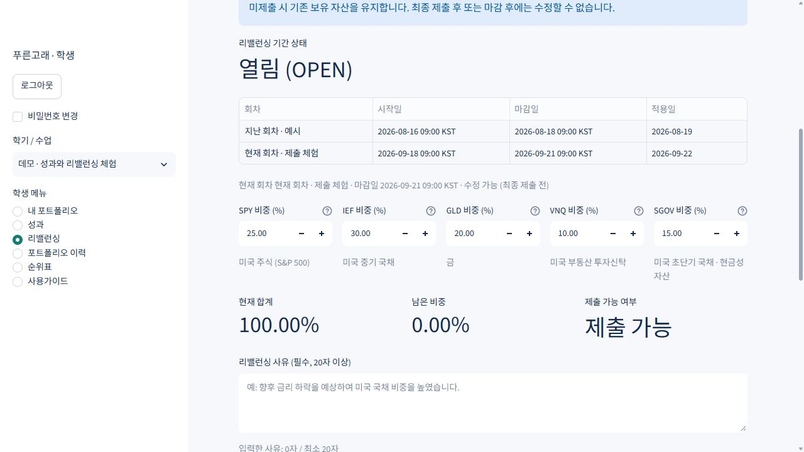

# AI ETF Portfolio Competition 학생 사용 설명서

이 앱은 한 학기 동안 ETF 자산배분과 환율 효과를 배우는 모의투자 도구입니다. 실제 돈이나 주문을 다루지 않으며 투자 조언을 제공하지 않습니다. 앱 이름의 AI는 수업 주제이며 자동 추천 기능은 없습니다.

**로그인 → 초기 자산배분 → NAV 확인 → 리밸런싱 → 성과·이력 확인**

## 1. 접속과 로그인

1. 담당 교수자가 안내한 앱 URL을 브라우저에서 엽니다. 학생은 프로그램 설치가 필요 없습니다.
2. 처음 접속하면 **처음 오셨나요? 학생 회원가입**을 열고 사용할 아이디, 공개 닉네임, 8자 이상 비밀번호와 확인 값을 입력합니다. 참여할 학기 / 수업을 선택하고 **회원가입**을 누른 뒤 직접 정한 계정으로 **로그인**합니다. 등록 가능한 학기가 없으면 가입 후 교수자에게 수강 등록을 요청하세요. 학생과 관리자는 같은 화면을 사용하지만 로그인 후 메뉴가 다릅니다.
3. 직접 가입한 학생은 비밀번호를 다시 변경할 필요가 없습니다. 교수자가 발급하거나 재설정한 임시 비밀번호로 로그인한 경우에는 **현재 비밀번호**, **새 비밀번호 (8자 이상)**, **새 비밀번호 확인**을 입력하고 **비밀번호 변경**을 누릅니다.
4. 사이드바의 **학기 / 수업**을 확인합니다. 자신이 등록된 학기만 보입니다. 학기가 없으면 교수자에게 등록을 요청하세요.

로그인 실패 시 아이디와 비밀번호를 다시 확인하세요. 5회 연속 실패하면 15분간 잠깁니다. 비밀번호 분실은 교수자에게 재설정을 요청하세요. 브라우저 새로고침이나 8시간 경과 시 다시 로그인해야 할 수 있습니다. 다른 사람에게 계정을 공유하지 마세요.

## 2. 내 포트폴리오: 현재 단계 확인

**메뉴 경로: 학생 메뉴 → 내 포트폴리오**

현재 학기와 닉네임, 초기 제출 상태, 리밸런싱 기간, 다음 마감일과 전체 마감 시각을 확인합니다. **지금 해야 할 일**을 따라 진행하세요. 최초 제출 전이면 배분 입력란이, 제출 후이면 최근 목표 비중과 성과가 표시됩니다. 최근 제출 비중은 적용 전일 수 있으며 실제 보유 비중은 가격 변화에 따라 달라집니다.

| 화면의 상태 | 의미 | 다음 행동 |
| --- | --- | --- |
| 진행 전 | 초기 배분을 아직 제출하지 않음 | 마감 전에 다섯 ETF 비중 입력 |
| 제출 완료 · 수정 불가 | 최종 저장된 기록 | 성과 확인, 오류는 교수자에게 문의 |
| 현재 이용 가능 | 리밸런싱 기간이 열림 | 리밸런싱 메뉴에서 사유와 새 비중 입력 |
| 기간 종료 / 예정 | 지금 입력할 리밸런싱이 없음 | 다음 마감 확인, 성과 검토 |
| 보관된 학기 | 학기 운영이 종료됨 | 과거 기록 열람 가능, 새 제출 불가 |

## 3. 다섯 ETF 이해하기

| ETF | 자산군 | 교육적으로 살펴볼 점 |
| --- | --- | --- |
| SPY | 미국 주식 (S&P 500) | 주식시장의 성장과 가격 변동 |
| IEF | 미국 중기 국채 | 금리 변화에 따른 채권 가격 변동 |
| GLD | 금 | 실물자산 노출과 분산 효과 |
| VNQ | 미국 리츠 | 부동산 관련 기업의 시장 위험 |
| SGOV | 미국 초단기 국채 / 현금성 자산 | 짧은 만기와 현금성 운용; 무위험 보장은 아님 |

다섯 ETF만 선택할 수 있습니다. 비중은 전체 모의 포트폴리오에서 차지하는 백분율입니다. 예: SPY 30%는 전체 자산의 30%를 SPY에 배분한다는 뜻입니다.

## 4. 초기 자산배분 입력과 최종 제출

**메뉴 경로: 내 포트폴리오**

1. **SPY 비중 (%)**, **IEF 비중 (%)**, **GLD 비중 (%)**, **VNQ 비중 (%)**, **SGOV 비중 (%)**을 입력합니다. 각각 0~100 범위이며 소수 비중도 가능합니다.
2. **현재 합계**, **남은 비중**, **제출 가능 여부**를 확인합니다. 예시 30 / 25 / 15 / 15 / 15는 합계 100%입니다.
3. 합계가 85%라면 15%가 남았습니다. 합계가 110%라면 비중을 총 10% 줄이세요. 정확히 100%가 아니면 최종 제출 버튼이 활성화되지 않습니다.
4. **최초 투자 전략 (선택)**에 전략을 적을 수 있습니다. 비워도 초기 제출은 가능합니다.
5. **제출 전 확인** 표에서 다섯 비중, 제출일, 적용일을 검토합니다. **제출 후 직접 수정할 수 없음을 확인했습니다.**를 체크합니다.
6. **초기 자산배분 최종 제출**을 누릅니다. 완료 안내와 **제출 완료 · 수정 불가**가 보이면 저장된 것입니다. 다음 단계는 **성과**입니다.

최종 제출 전 입력은 화면의 임시 입력입니다. 저장 버튼을 누르지 않은 초안은 새로고침·로그아웃 시 사라질 수 있습니다. 제출 후에는 공정성을 위해 학생이 다시 수정할 수 없습니다. 오류가 있다면 교수자가 사유를 남겨 새 정정 버전을 추가합니다. 마감 뒤 제출을 새로 만드는 기능은 없으므로 기한을 지키세요.

## 5. 성과: NAV와 달러·원화 수익률

**메뉴 경로: 성과**. 입력할 값이나 저장 버튼은 없습니다. 먼저 가격·환율 기준일과 데이터 상태를 확인하세요.

**포트폴리오 NAV (Portfolio NAV)**는 시작값 100인 모의 포트폴리오 가치 지수입니다. 105이면 누적수익률 +5%, 95이면 -5%입니다. SPY 등 ETF 운용사가 공시하는 공식 NAV가 아닙니다. **달러 기준 수익률 (USD Return)**은 환율을 제외한 달러 투자 성과, **원화 기준 수익률 (KRW Return)**은 원화로 환산한 성과입니다.

USD/KRW는 1달러당 원화 금액입니다. 다른 조건이 같을 때 환율 상승은 달러 보유자의 원화 가치에 유리합니다. 달러 수익률 10%, 환율 상승률 5%이면 원화 수익률은 15.5%입니다. 10%와 5%를 단순히 더하지 않습니다.

포트폴리오 가치 그래프는 달러·원화 NAV를 비교합니다. ETF 그래프와 표는 학생의 비중과 별개로 각 ETF 자체의 시작일 대비 성과를 보여줍니다. 각 그래프 아래 기준일을 확인하세요. 세로축은 작은 변화를 볼 수 있도록 0에서 시작하지 않을 수 있습니다.

### 계산 규칙

시작일이 휴장일이면 그 이후 첫 미국 거래일 종가에서 NAV 100으로 시작합니다. 비중을 0~1 비율 w로 표시하면 처음 ETF별 가치 H는 `100 × w`입니다. 다음 거래일에는 `H = 직전 H × 당일 수정종가 / 직전 거래일 수정종가`이며 NAV는 다섯 H의 합입니다. 두 수정종가는 같은 수집 시점의 자료로 일별 비율을 계산하여 저장합니다. 배당·분할 효과는 수정종가에 포함하고 배당을 따로 중복 적립하지 않습니다. 거래비용·세금은 0으로 가정합니다.

달러 수익률 = USD NAV / 100 - 1.
원화 NAV = USD NAV × 현재 USD/KRW / 시작 USD/KRW.
원화 수익률 = (1 + 달러 수익률) × 현재 환율 / 시작 환율 - 1.

리밸런싱 적용일 종가까지는 기존 자산으로 수익을 계산한 뒤 새 비중으로 재배분합니다. 따라서 새 비중의 수익은 다음 거래 구간부터 반영됩니다. 미제출 시 기존 보유 자산을 유지하며 매일 목표 비중으로 조정하지 않습니다.

### 데이터 상태 읽기

교수가 저장한 ETF 수정종가 일별 비율과 같은 날짜의 원/달러 환율을 모두가 공유합니다. 환율은 주식 종가와 정확히 같은 시각이 아니라 같은 날짜의 일별 관측치입니다. 실시간 시세가 아닙니다. 거래일 누락·잘못된 값·오래된 데이터가 있으면 그래프와 공식 순위를 보류합니다. 저장된 배분이 사라진 것은 아닙니다. 교수자에게 데이터 갱신을 요청하세요. **미확정** 또는 **재확정 필요**는 잠정 계산, **공식 확정**은 교수자가 계산 기록을 보존한 상태입니다.

## 6. 리밸런싱 입력·검토·잠금

**메뉴 경로: 리밸런싱**

1. **리밸런싱 기간 상태**가 **열림 (OPEN)**인지 확인합니다. 표의 시작일·마감일은 한국 시간, 적용일은 미국 거래일 날짜입니다.
2. 현재 회차의 비중을 입력합니다. 기본값은 최근 제출 목표 비중입니다. 합계가 정확히 100%인지 확인하세요.
3. **리밸런싱 사유 (필수, 20자 이상)**를 입력합니다. 예: “향후 금리 하락을 예상하여 미국 국채 비중을 높였습니다.” 같은 비중을 유지하는 이유도 적을 수 있습니다.
4. **제출 전 확인**에서 이전 목표 비중과 새 비중, 사유, 적용일을 비교합니다.
5. **변경 사유와 비중을 확인했으며 최종 제출에 동의합니다.**를 체크하고 **리밸런싱 최종 제출**을 누릅니다.
6. 완료 후 표시된 비중·사유·제출일·적용일과 **수정 불가**를 확인합니다. 다음 단계는 **포트폴리오 이력**입니다.

**닫힘 (CLOSED)**이면 입력할 수 없습니다. 마감 후에는 수정하거나 추가 제출할 수 없습니다. 기본 일정 간격은 2주지만 교수가 다르게 설정할 수 있습니다. 회차를 놓치면 기존 보유 자산을 그대로 유지합니다.

## 7. 포트폴리오 이력과 순위표

**포트폴리오 이력**에서 회차를 펼쳐 비중·사유·제출일·적용일·버전 수·잠금 상태를 확인합니다. 유효한 가격이 있으면 실제 적용 거래일의 NAV와 두 통화 수익률도 표시됩니다. 최신 정정 버전이 보이고 이전 버전은 삭제되지 않습니다. 정정에 따른 성과 변화는 교수자에게 문의하세요.

**순위표**는 교수가 공개한 경우에만 메뉴에 나타납니다. 비공개이면 내 포트폴리오에 “현재 순위표는 교수자가 비공개로 설정했습니다.”가 표시됩니다. 공개 순위는 달러 누적수익률 소수점 6자리 기준이며 동률은 1, 1, 3 방식입니다. 최근 2주 수익률은 측정일에서 14일 전 또는 그 직전 거래일 대비 값이며 이력이 짧으면 비어 있습니다. 기준일과 공식 확정 표시를 확인하세요. 다른 학생의 상세 비중·개인 아이디는 순위표에서 볼 수 없습니다.

## 8. 로그아웃과 문제 해결

사용을 마치면 사이드바의 **로그아웃**을 누르세요. 새 비밀번호 설정은 사이드바의 **비밀번호 변경**에서 가능합니다.

| 상황 | 저장 상태와 해결 방법 |
| --- | --- |
| 합계가 100%가 아님 | 아직 제출되지 않았습니다. 남은 비중을 0%로 맞추세요. |
| 제출 버튼이 비활성화됨 | 합계, 확인 체크, 리밸런싱 사유 20자를 확인하세요. |
| 이미 최종 제출됨 | 기존 제출은 유지됩니다. 직접 수정은 불가능합니다. |
| 마감 또는 보관된 학기 | 새 입력은 저장되지 않습니다. 학기와 기한을 확인하세요. |
| NAV가 보이지 않음 | 초기 제출과 시작일 가격이 필요합니다. 데이터 경고는 교수자에게 전달하세요. |
| 순위가 보류됨 | 공식 데이터 점검·확정이 필요합니다. 배분 기록은 보존됩니다. |
| 연결 오류 또는 저장 여부 불명 | 재로그인 후 이력을 먼저 확인하고, 기록이 없을 때 다시 시도하세요. |

해결되지 않으면 교수자에게 **학기명, 닉네임, 메뉴명, 발생 시각, 화면에 표시된 안내**를 전달하세요. 비밀번호는 보내지 마세요. 필요하면 본인 화면만 캡처하고 다른 사람 정보는 포함하지 마세요.
